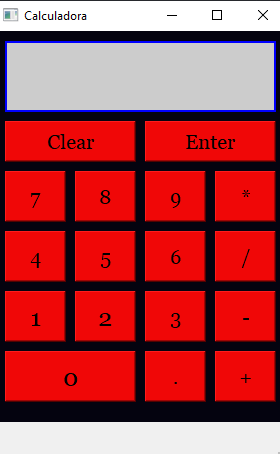

# Pagina Estática | ArtMex

## Herramientas
* Python
* Qtdisainer
* Pyside2

## Descripción
* Calculadora para resolver operaciónes básicas 

#
## Instrucciones
El codigo se encuentra en la carpeta python, si tienes
instalado Qtdisainer instalado y python obvio puedes correr el archivo core.py que es el cual corre todo los demas archivos, el archivo ui contiene codigo de la interfaz de qtdisainer y el archivo ui_caluladora.py es la convercion a python de el archivo .ui, el codigo logico esta en el archivo main.py por si necesitas algo de ahi.
#
## Imágenes de muestra

